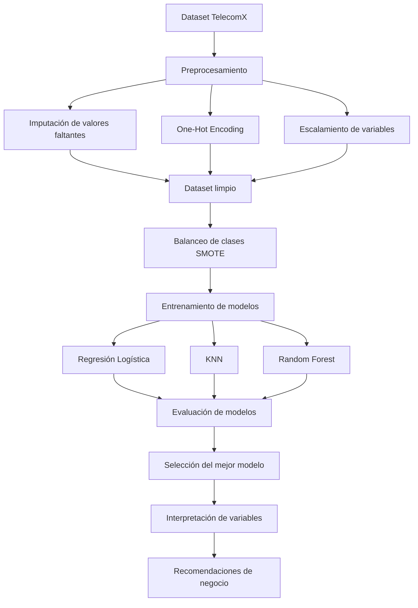
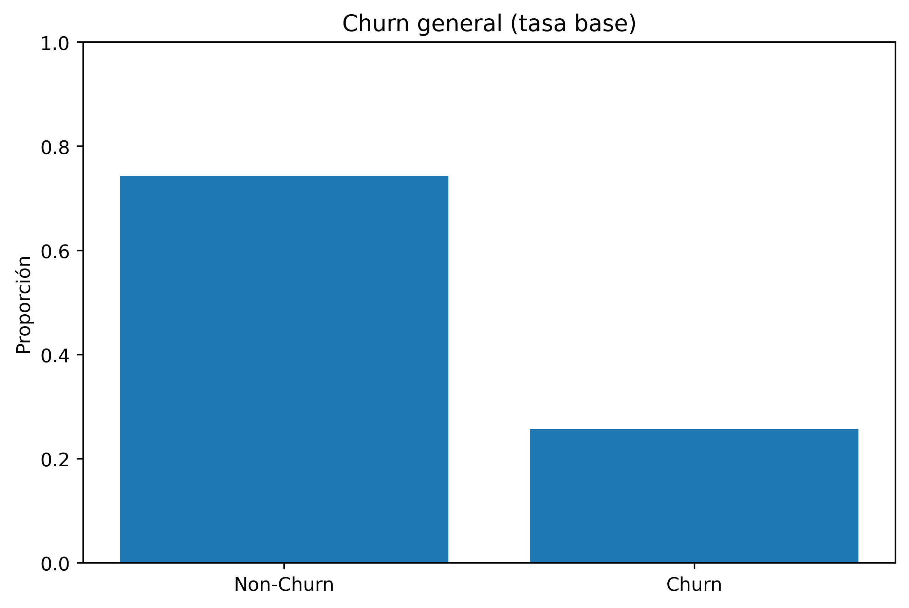
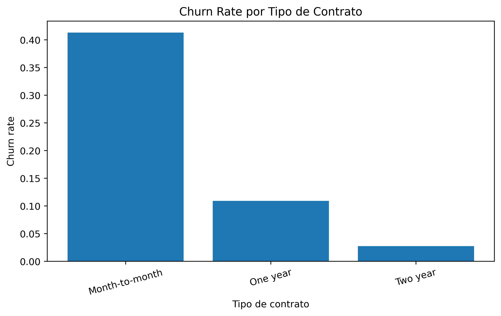

# 📊 Predicción de Cancelación de Clientes (Churn)
## TelecomX LATAM


---

# 🚀 Proyecto de Ciencia de Datos End-to-End

Este proyecto desarrolla un **pipeline completo de Machine Learning** para analizar y predecir la cancelación de clientes (**churn**) en la empresa ficticia de telecomunicaciones **TelecomX LATAM**.

La cancelación de clientes es uno de los problemas más importantes para empresas de servicios, ya que impacta directamente los ingresos y aumenta el costo de adquisición de nuevos clientes.

Mediante técnicas de **Ciencia de Datos**, este proyecto busca:

- identificar los factores que influyen en la cancelación
- construir modelos predictivos
- generar recomendaciones estratégicas para reducir churn

---

# 🎯 Objetivos del Proyecto

- Analizar patrones de comportamiento de clientes.
- Identificar variables asociadas con la cancelación.
- Construir modelos predictivos de Machine Learning.
- Comparar distintos algoritmos de clasificación.
- Interpretar los modelos para extraer insights.
- Proponer acciones estratégicas de retención.

---

# 🧠 Flujo de Trabajo de Ciencia de Datos

```text
Dataset TelecomX
        ↓
Limpieza de datos
        ↓
Análisis Exploratorio de Datos
        ↓
Ingeniería de Variables (Características)
        ↓
Balanceo de clases (SMOTE)
        ↓
Entrenamiento de modelos
        ↓
Evaluación de modelos
        ↓
Interpretación
        ↓
Recomendaciones estratégicas
```

---

# 🏗 Arquitectura del Pipeline de Machine Learning



---

# 📂 Dataset

El dataset contiene información sobre clientes de TelecomX:

- características demográficas
- servicios contratados
- tipo de contrato
- tipo de internet
- servicios adicionales
- facturación
- métodos de pago

## Variable objetivo

```
Churn
```

- **1 → Cliente canceló el servicio**
- **0 → Cliente permanece**

---

# 🧹 Preparación de los Datos

Se aplicaron varias técnicas de preparación de datos:

### Limpieza

- eliminación de columnas irrelevantes
- tratamiento de valores inconsistentes

### Ingeniería de variables (Características)

- One-Hot Encoding
- conversión de variables booleanas

### Imputación

- variables numéricas → mediana (Realizado en Parte I)
- variables categóricas → valor más frecuente (Realizado por defecto en Parte II)

### Escalamiento

```
StandardScaler
```

---

# ⚖ Manejo del Desbalance de Clases

El dataset presenta un desbalance entre clientes churn y no churn.

Se evaluaron tres estrategias:

| Estrategia | Descripción |
|------------|-------------|
Baseline | Modelo sin balanceo |
Class Weight | Penalización de errores |
SMOTE | Generación sintética de churn |

SMOTE mejoró significativamente la capacidad del modelo para detectar churn.

---

# 🤖 Modelos Evaluados

| Modelo | Descripción |
|------|-------------|
Regresión Logística | Modelo lineal interpretable |
KNN | Clasificador basado en distancia |
Random Forest | Ensamble basado en árboles |

---

# 📊 Comparación de Modelos

| Modelo | Recall | F1 Score | ROC-AUC | PR-AUC |
|------|------|------|------|------|
Logistic Regression | 0.54 | 0.58 | 0.84 | 0.62 |
Logistic Regression Balanced | 0.81 | 0.62 | 0.84 | 0.62 |
**Logistic Regression + SMOTE** | **0.80** | **0.63** | **0.84** | **0.62** |
KNN | 0.49 | 0.52 | 0.78 | 0.49 |
KNN + SMOTE | 0.69 | 0.54 | 0.76 | 0.45 |
Random Forest | 0.50 | 0.54 | 0.82 | 0.56 |

---

# 🏆 Modelo Ganador

```
Regresión Logística + SMOTE
```

Resultados principales:

| Métrica | Resultado |
|------|------|
Recall | ~0.80 |
F1-score | ~0.63 |
ROC-AUC | ~0.84 |
PR-AUC | ~0.62 |

---

# 📊 Visualizaciones Clave

## Distribución de churn



---

## Churn por tipo de contrato



---

## Churn por método de pago


---

## Churn vs antigüedad del cliente


---

# 📈 Variables más influyentes

## Variables que aumentan churn

- contratos **mes a mes**
- servicio de **fibra óptica**
- falta de **soporte técnico**
- falta de **seguridad en línea**
- método de pago **electronic check**

## Variables que reducen churn

- mayor **antigüedad del cliente**
- **contratos de dos años**
- clientes con **dependientes**

---

# 💡 Impacto de Negocio

Los resultados permiten identificar oportunidades claras para reducir churn:

### Retención temprana
Clientes con menor antigüedad presentan mayor riesgo.

### Contratos de largo plazo
Promover contratos anuales o bianuales.

### Promoción de servicios adicionales
Servicios como soporte técnico y seguridad reducen churn.

### Análisis de clientes de fibra óptica
Segmento con mayor cancelación.

### Optimización de métodos de pago
Promover pagos automáticos.

---

# 🛠 Tecnologías Utilizadas

```
Python
Pandas
NumPy
Scikit-Learn
Imbalanced-Learn
Matplotlib
Google Colab
GitHub
```

---

# 📁 Estructura del Repositorio

```
telecomx-churn-prediction/

├── TelecomX_LATAM.ipynb
├── TelecomX_LATAM.csv
├── README.md
└── images
    ├── Churn_general_tasa_base.png
    ├── Churn_rate_por_tipo_de_contrato.png
    ├── Churn_rate_por_metodo_de_pago.png
    ├── Churn_rate_por_antiguedad_tenure_bins.png
```

---

# 🔬 Reproducibilidad

Clonar repositorio

```
git clone https://github.com/tu_usuario/telecomx-churn-analysis
```

Instalar dependencias

```
pip install pandas numpy scikit-learn imbalanced-learn matplotlib
```

Abrir el notebook en **Google Colab o Jupyter Notebook**.

---

# 🔮 Mejoras Futuras

- optimización de hiperparámetros
- modelos Gradient Boosting
- dashboards de negocio

---
## ⭐ Portafolio de Data Science

Este proyecto forma parte de mi portafolio de Ciencia de Datos donde aplico:

- Machine Learning
- Análisis de datos
- Modelado predictivo
- Interpretabilidad de modelos
- Recomendaciones estratégicas de negocio

---
# 👨‍💻 Autor

**Carlos Patricio Luis Castillo**

Proyecto de Ciencia de Datos  
Machine Learning aplicado al análisis de churn en telecomunicaciones.

---

⭐ Si este proyecto te resultó interesante puedes **darle una estrella al repositorio**.
